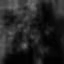
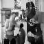
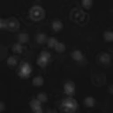
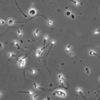
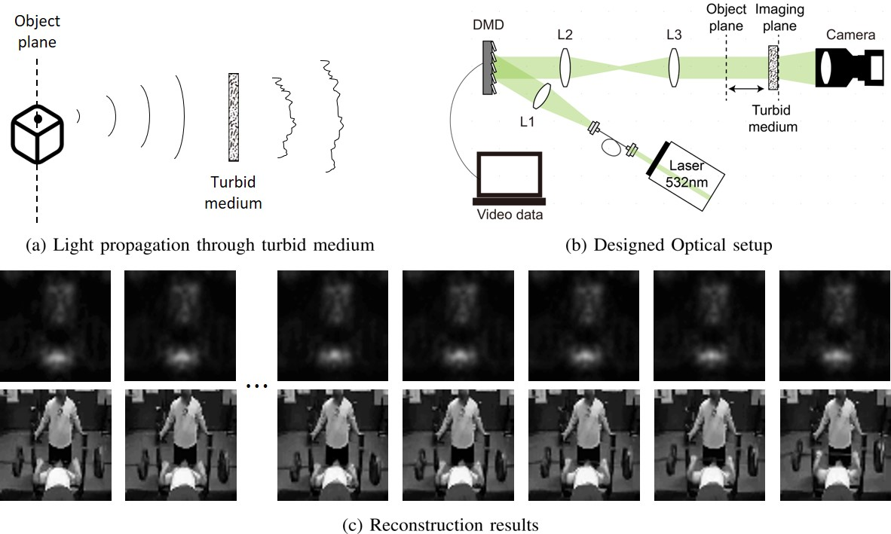

# Seeing Video Through Optical Scattering Media using Spatio-Temporal Diffusion Models

<p align="center" width="100%">
    
    
    
    
</p>

<p align="center" width="100%">
    
</p>


## Abstract
Optical scattering causes light rays to deviate from their trajectory, posing challenges for imaging through scattering media such as fog and biological tissues. Although diffusion models have been extensively studied for various inverse problems in recent years, its extension to video recovery, especially through highly scattering media, has been an open problem due to the lack of a closed-form forward model and the difficulty of exploiting the spatio-temporal correlation. To address this,  here we present a novel inverse scattering solver using a video diffusion model. In particular, by deriving a closed-form forward model from the shower-curtain effect in a dynamic scattering medium, we develop a video diffusion posterior sampling scheme using a diffusion model with temporal attention that maximally exploits the statistical correlation between a series of frames and a series of scattered signals. Unlike previous end-to-end approaches only relied on spatial correlation between a scene and a scattered signal at a specific time point, the adaptability of the proposed method is highly extendable to various types of scenes, various thicknesses of scattering media, and varying distances between a target scene and a medium.  In particular, the use of temporal correlation is shown to be critical to faithfully retrieve high-frequency components which are often missed by inverse operations only in spatial domain.  Experimental results using the video datasets of moving sperm cells verify the effectiveness of the proposed method. To the best of our knowledge, this is the first video diffusion model to jointly utilize the correlations in both spatial and temporal domains in solving the inverse scattering problem.


## Prerequisites
- python 3.10

- pytorch 1.13.1

- CUDA 11.7

It is okay to use lower version of CUDA with proper pytorch version.

Ex) CUDA 10.2 with pytorch 1.7.0

<br />

## Getting started 

### 1) Clone the repository

```
git clone https://github.com/video-through-scattering2023/video-through-scattering

cd video-through-scattering
```

<br />

### 2) Download pretrained checkpoint and sample videos
From the [link](https://drive.google.com/drive/folders/1-Zu7GL2dooGFJYEO34s9U0J03LKqd6I6?usp=sharing), download the checkpoints and paste it to ./models/, download the samples and paste it to ./scatter samples/
```
mkdir models
mkdir scatter samples
mv {MODEL_DOWNLOAD_DIR}/{CHECKPOINT NAME} ./{models}/
mv {SAMPLE_DOWNLOAD_DIR}/{SAMPLES} ./{scatter samples}/
```
{DOWNLOAD_DIR} is the directory that you downloaded checkpoint to.
{PASTE_DIR} is the directory that you should paste to.

<br />

### 3) Set environment
Install dependencies

```
conda create -n VTS python=3.10

conda activate VTS

pip install -r requirements.txt

pip install torch==1.13.1+cu117 torchvision==0.14.1+cu117 torchaudio==0.13.1 --extra-index-url https://download.pytorch.org/whl/cu117
```

<br />

### 4) Test

```
python test_UCF.py
python test_VISEM.py
```

<br />
